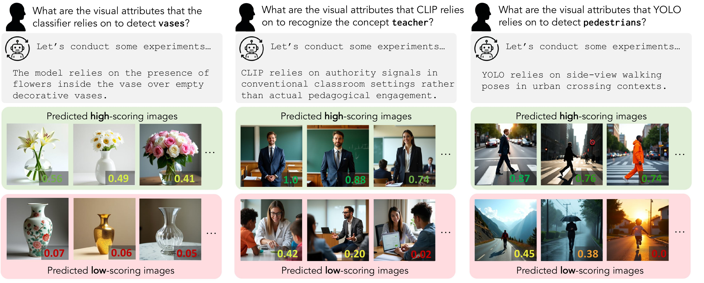

# Automated Detection of Visual Attribute Reliance with a Self-Reflective Agent #
## ICML 2025 Workshop on Actionable Interpretability ##

[Christy Li](https://christykl.github.io/), [Josep Lopez Camuñas](https://yusepp.github.io/), [Jake Touchet](https://www.linkedin.com/in/jake-touchet-557329297/), [Jacob Andreas](https://www.mit.edu/~jda/), [Agata Lapedriza Garcia](https://s3.sunai.uoc.edu/web/agata/index.html), [Antonio Torralba](https://groups.csail.mit.edu/vision/torralbalab/), [Tamar Rott Shaham](https://tamarott.github.io/)



We use a Self-reflective Automated Interpretability Agent (SAIA) to produce natural-language descriptions of the visual attributes that a model relies on to recognize or detect a given concept. For each target concept (e.g., *vase*, *teacher*, or *pedestrian*), the agent first conducts hypothesis testing to reach a candidate description and then validates the description's predictiveness of actual model behavior through a self-evaluation protocol. The top row shows the agent’s generated explanations. The bottom rows show images predicted to elicit high (green) or low (red) scores, along with their actual model confidence scores. Results are shown for different target concepts across an object recognition model with a controlled attribute reliance (left), CLIP (middle), and YOLOv8 (right).

## Installations ##
After cloning this repo, simply run
```bash
bash install.sh
```

To download precomputed exemplars for the attribute reliance benchmark models, run
```bash
bash download_exemplars.sh
```

## Quick Start ##
You can run demo experiments on individual units using ```demo.ipynb```:
\
\
Launch Jupyter Notebook
```bash
jupyter notebook
```
This command will start the Jupyter Notebook server and open the Jupyter Notebook interface in your default web browser. The interface will show all the notebooks, files, and subdirectories in this repo (assuming is was initiated from the root of the repo directory). Open ```demo.ipynb``` and proceed according to the instructions.

## Batch experimentation ##
To run a batch of experiments, use ```main.py```:

### Load OpenAI or Anthropic API key ###
(you can get an OpenAI API key by following the instructions [here](https://platform.openai.com/docs/quickstart) and an Anthropic API key by following the instructions [here](https://docs.anthropic.com/en/docs/get-started)).

Set your API key as an environment variable
```bash
export OPENAI_API_KEY='your-openai-api-key-here'
export ANTHROPIC_API_KEY='your-anthropic-api-key-here'
```

### Load Huggingface key ###
You will need a Huggingface API key if you want to use Stable Diffusion 3.5 as the text2image model (you can get a HuggingFace API key by following the instructions [here](https://huggingface.co/stabilityai/stable-diffusion-3.5-medium)).

Set your API key as an environment variable
```bash
export HF_TOKEN='your-hf-token-here'
```

### Run Agent ###
To run the model on a benchmark model, specify the ```bias_mode```, ```bias```, and ```classifiers``` by calling e.g.:
```bash
python main.py --bias_mode setting --bias beach --classifiers 0 1
``` 
Refer to the ```./exemplars/``` folder to choose the classifier numbers based on desired target concepts, e.g. classifier 0 of the beach setting-dependent system refers to the target concept "bench", and classifier 1 of the same system refers to the target concept "bird".

To run the model on CLIP, set ```bias_mode``` and ```bias``` to ```clip```, and ```classifiers``` by calling e.g.:
```bash
python main.py --bias_mode setting --bias beach --classifiers "scientist" "artist"
``` 
Refer to the documentation of ```main.py``` for more configuration options.

Results are automatically saved to an html file under ```./results/``` and can be viewed in your browser by starting a local server:
```bash
python -m http.server 80
```
Once the server is up, open the html in [http://localhost:80](http://localhost:80/results/)